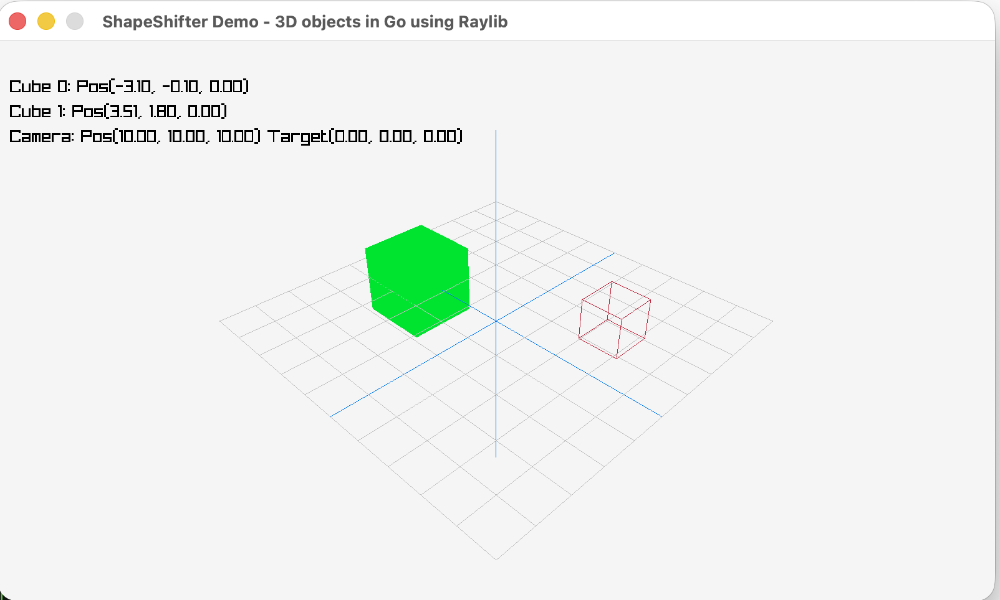

# ShapeShifter

This is an application demonstrating interactive computer graphics, using the Raylib graphics library and Go.

## How to run

``` bash
go run main.go
```

## References

- [Raylib](https://www.raylib.com/index.html)
- [Raylib-go](https://github.com/gen2brain/raylib-go)

## Screenshots


